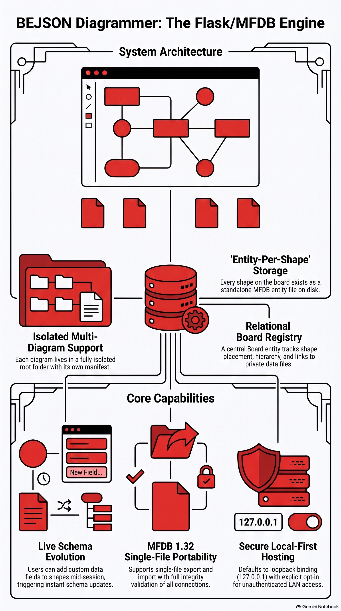
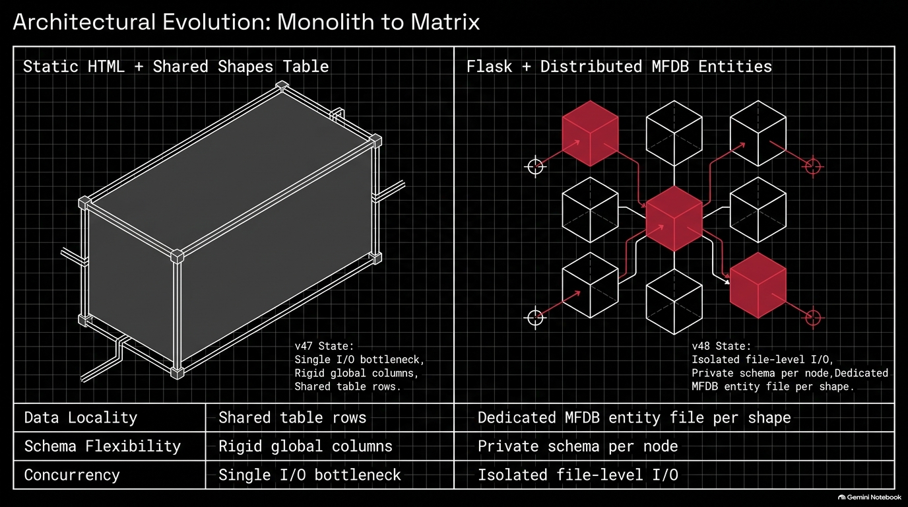
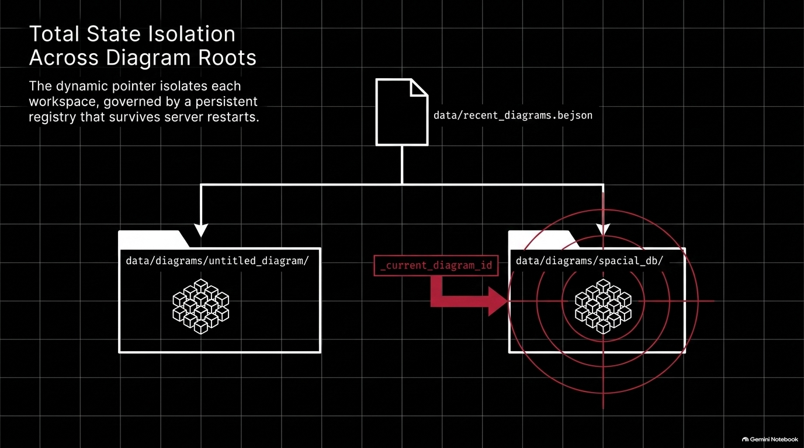
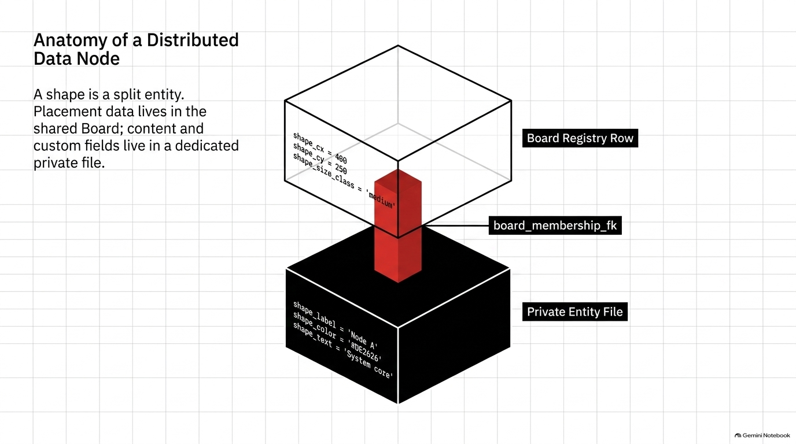
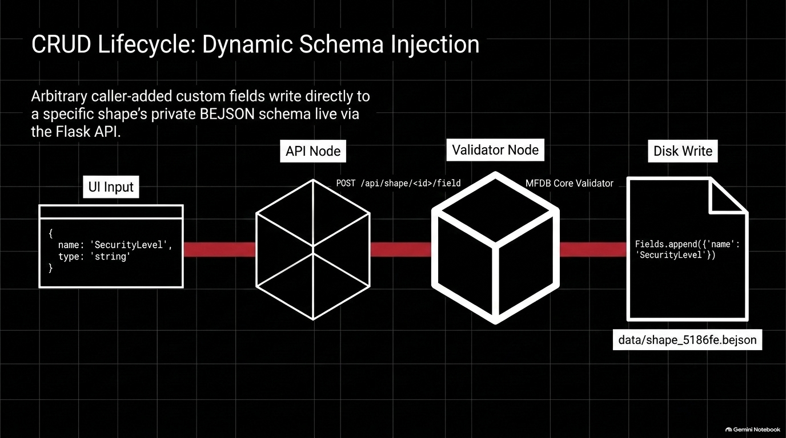
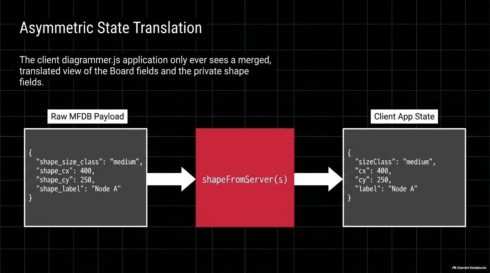
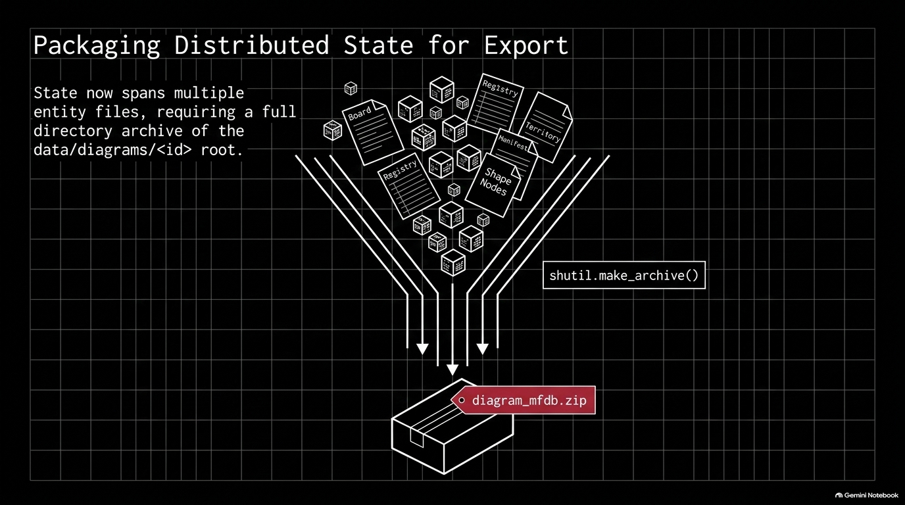
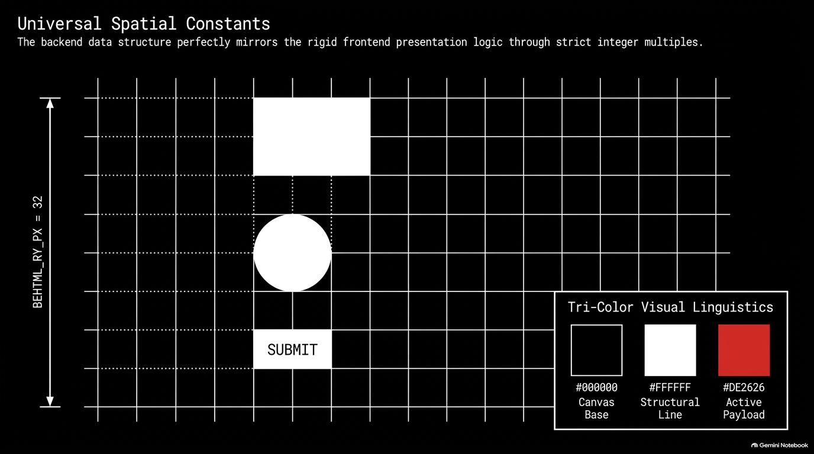
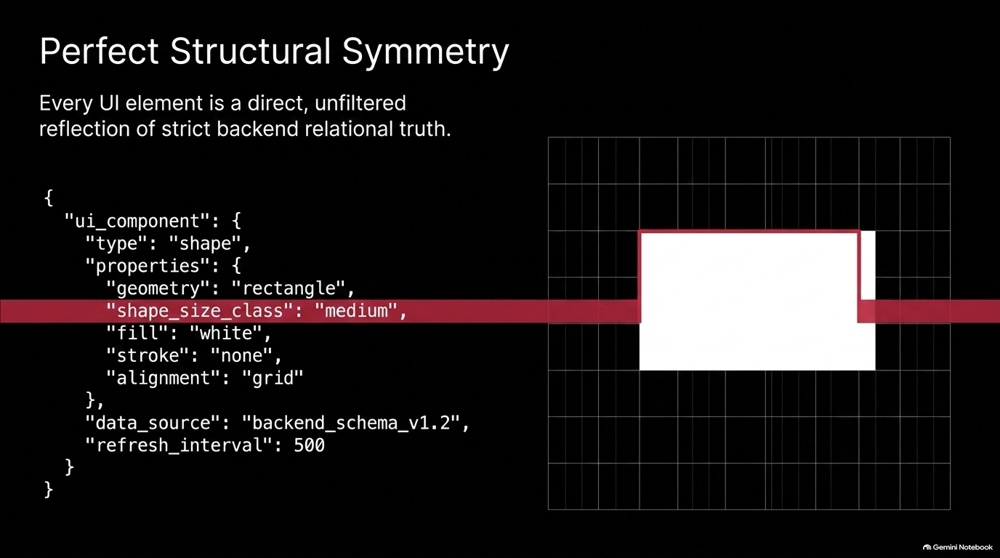

# BEJSON Diagrammer — Flask / MFDB Edition

Author: **Elton Boehnen**  
Contact: [eltonboehnen@gmail.com](mailto:eltonboehnen@gmail.com) | [boehnenelton2024.pages.dev](https://boehnenelton2024.pages.dev) | [github.com/boehnenelton](https://github.com/boehnenelton)  
Relational ID: `8f3e1a2b-9c4d-4e5f-a6b7-0c1d2e3f4a5b`  
Version: **1.3.0**

---

## Overview

The **BEJSON Diagrammer (Flask / MFDB Edition)** is an interactive, web-based diagramming and spatial mapping workspace where **every single shape placed on the canvas is backed by its own dedicated Multi-File Database (MFDB) entity file**. Built on top of the strict **BEJSON 104 Core** specification and the **Diagrams Library Family**, this platform bridges visual diagramming with structured, field-addressable database persistence.

Unlike traditional diagramming tools that collapse visual nodes into flat JSON arrays or unstructured SVG blobs, BEJSON Diagrammer treats every shape as a standalone database record with its own customizable schema, field types, and relational linkages. Connectors and spatial territories operate as high-performance multi-row registry entities, allowing complex topological graphs, system architecture maps, flowcharts, and spatial database models to be authored, queried, and migrated directly on disk.



---

## Architectural Principles & Core Philosophy

1. **Entity-per-Shape Architecture**: Every node on the canvas generates a dedicated `.bejson` entity file under `data/diagrams/<diagram_id>/data/shape_shape_<hash>.bejson`.
2. **BEJSON 104 Native Core**: Zero external SQL/NoSQL dependencies. Pure atomic, lock-free file transactions using strictly formatted BEJSON headers and tabular arrays.
3. **Relational Registry Integrity**: Global canvas positioning, shape dimensions, tree hierarchies, and foreign keys are governed by the `Board` entity, linking directly to each shape's private schema.
4. **Single-File Portable Packaging (.mfdb132.bejson)**: Complete diagrams—including manifest files, individual entity schemas, connectors, and spatial bounds—export and import seamlessly as unified BEJSON documents.
5. **Dynamic Runtime Schema Mutation**: Users can attach arbitrary custom fields (`string`, `number`, `boolean`) to specific shapes directly through the web UI, modifying the underlying BEJSON schema on the fly.

---

## System Blueprint & Technical Workflow

The following sections illustrate the structural layout, data flow, entity definitions, and operational workflows powering the BEJSON Diagrammer platform.

### 1. Database Layout & Workspace Foundations

The foundation of the diagrammer relies on isolated multi-file database root directories. Each active diagram project contains its own manifest definition (`104a.mfdb.bejson`) alongside a `data/` subfolder housing entity data.


When a diagram session is initialized, the server reads the recent diagrams registry (`data/recent_diagrams.bejson`), locates the target manifest, and loads all connected entities into memory for client synchronization.

---

### 2. Multi-File Database (MFDB) Relational Model

The MFDB architecture establishes a strict relational framework linking spatial canvas coordinates with private shape data structures.



* **Board Registry**: Maps canvas coordinates (`shape_cx`, `shape_cy`), size classes, geometric kinds (`rect`, `circle`), and parent node linkages (`shape_parent_fk`).
* **Private Shape Entities**: Store label content, body text, visual styles, and user-defined custom fields.
* **Connector Entity**: Tracks relational directional flows (`none`, `forward`, `backward`, `bidirectional`) between arbitrary shape endpoints (`conn_from_fk` -> `conn_to_fk`).
* **Territory Entity**: Defines spatial bounding regions (`rect`, `circle`), ambient fill colors, and region titles.

---

### 3. Entity Creation & Dynamic Schema Extension

Adding a node on the canvas triggers a multi-step atomic write sequence managed by `src/diagram_mfdb.py`.



1. **ID Generation**: A cryptographic UUID slug is assigned (e.g., `shape_5186fe2837`).
2. **Board Entry**: A record is appended to `data/board.bejson`.
3. **Private File Instantiation**: A new BEJSON file is generated containing base shape fields (`shape_id`, `shape_label`, `shape_color`, `shape_font_color`, `shape_text`).
4. **Schema Modification**: Custom fields created by the user append new field definitions to the entity's header and update corresponding record rows.

---

### 4. Interactive Spatial Canvas & Real-Time Sync

The front-end client (`static/js/diagrammer.js`) maintains an interactive HTML5/SVG canvas featuring grid snapping, smooth panning, multi-touch zooming, and adaptive rulers.



All spatial movements (dragging nodes or territories) execute immediate optimistic rendering client-side while dispatching REST API updates to persist updated matrix coordinates directly to disk.

---

### 5. Parent-Child Hierarchies & Tree Reparenting

Nodes support arbitrary tree structures. When a child node is appended to a parent shape, the diagrammer automatically calculates collision-free layout coordinates and establishes foreign key relationships.



Deleting a parent shape triggers an automatic cascade: child nodes are reparented to the deleted shape's parent (skipping a generation), ensuring graph integrity without leaving dangling foreign key references in the database.

---

### 6. Connector Line Flow & Endpoint Attachment

Connectors anchor dynamically to the edges of bounding boxes rather than static node centers, calculating intersection math in real time during drag events.


Visual flow direction indicators (SVG markers) dynamically reflect connection types (`forward`, `backward`, `bidirectional`, or `none`).

---

### 7. Spatial Bounding Territories & Automatic Theming

Territories allow visual grouping of related system components. Shapes situated within a territory automatically inherit the ambient theme color of the bounding region.



Territory controls provide on-canvas sizing handles (+/- buttons) and quick color picker controls without obscuring underlying shapes.

---

### 8. Single-File Portable Export & Validation (.mfdb132.bejson)

The system utilizes the **BEJSON Diagrams Core Library** (`lib_bejson_Diagrams_diagrams_core.py`) to compile complete multi-file database structures into a single compressed JSON package.



Prior to writing or importing `.mfdb132.bejson` packages, the system runs strict validation checking:
* BEJSON 104 document syntax and header integrity.
* MFDB database manifest consistency.
* Referential integrity of all shape parents, connectors, and territory boundaries.

---

### 9. REST API Engine & Route Mapping

The Flask backend (`src/routes.py`) exposes full CRUD REST endpoints for shapes, connectors, territories, schemas, and diagram management.



All endpoints utilize standard JSON response structures and return clear HTTP status codes and diagnostic error messages.

---

### 10. Modular Architecture & Core Libraries

The codebase adheres strictly to single-concern modular design rules across core handling, validation, route dispatching, and UI management.



* `launcher.py`: Environment setup and Flask dev server entry point.
* `src/diagram_mfdb.py`: MFDB database layer, CRUD operations, and diagram state manager.
* `src/routes.py`: Flask Blueprint endpoints and file handling.
* `lib/`: Standardized BEJSON core, MFDB validation, path guards, and Diagrams packaging libraries.
* `static/js/diagrammer.js`: Modern vanillajs canvas renderer and state controller.

---

## Directory Structure & Project Layout

```
MFDB_Diagrammer/
├── .bejson_project.json         # Project tracking registry
├── context.bejson               # Project rules & purpose context
├── launcher.py                  # Main launcher & entry point
├── README.md                    # Project documentation
├── error.txt                    # Log output buffer
├── images/                      # Embedded architecture diagrams
│   ├── BEJSON_Diagrammer_System_Architecture.png
│   ├── MFDB_System_Blueprint_-_Slide_1.png
│   ├── MFDB_System_Blueprint_-_Slide_2.png
│   ├── MFDB_System_Blueprint_-_Slide_3.png
│   ├── MFDB_System_Blueprint_-_Slide_5.png
│   ├── MFDB_System_Blueprint_-_Slide_6.png
│   ├── MFDB_System_Blueprint_-_Slide_7.png
│   ├── MFDB_System_Blueprint_-_Slide_8.png
│   ├── MFDB_System_Blueprint_-_Slide_9.png
│   ├── MFDB_System_Blueprint_-_Slide_10.png
│   └── MFDB_System_Blueprint_-_Slide_11.png
├── data/                        # Persistent storage root
│   ├── recent_diagrams.bejson   # Diagram registry index
│   └── diagrams/                # Individual diagram MFDB folders
│       ├── spacial_db/
│       ├── test_diagram/
│       └── untitled_diagram/
├── lib/                         # BEJSON & MFDB core libraries
│   ├── lib_bejson_Core_bejson_chunking.py
│   ├── lib_bejson_Core_bejson_core.py
│   ├── lib_bejson_Core_bejson_env.py
│   ├── lib_bejson_Core_bejson_errors.py
│   ├── lib_bejson_Core_bejson_path_guard.py
│   ├── lib_bejson_Core_bejson_validator.py
│   ├── lib_bejson_Core_mfdb_core.py
│   ├── lib_bejson_Core_mfdb_validator.py
│   ├── lib_bejson_Diagrams_bejson_errors.py
│   ├── lib_bejson_Diagrams_diagrams_core.py
│   └── lib_bejson_Diagrams_diagrams_validator.py
├── src/                         # Application backend logic
│   ├── diagram_mfdb.py          # MFDB service layer
│   └── routes.py                # REST API routes
├── static/                      # Web frontend assets
│   └── js/
│       └── diagrammer.js        # Canvas & interaction engine
├── templates/                   # Frontend markup templates
│   └── index.html               # Main UI view
└── tests/                       # Automated test suite
    ├── test_diagram_mfdb.py     # Backend & MFDB unit tests
    └── test_routes.py           # API endpoint integration tests
```

---

## Installation & Setup Guide

### Prerequisites

* **Python**: Version 3.10 or higher.
* **Dependencies**: `flask`, `pytest` (for running automated tests).

### Quickstart Command Sequence

1. **Clone or Navigate to the Repository**:
   ```bash
   cd /storage/emulated/0/Admin/dev/Python/MFDB_Diagrammer
   ```

2. **Install Required Packages**:
   ```bash
   pip install flask pytest
   ```

3. **Run Automated Test Suite**:
   Execute `pytest` immediately to verify backend routing, BEJSON document integrity, and MFDB database operations:
   ```bash
   pytest
   ```

4. **Launch Application Server**:
   Start the application via `launcher.py`:
   ```bash
   python launcher.py
   ```
   The Flask server will launch on `http://0.0.0.0:5000`.

---

## API Documentation

### Diagram Management

* **`GET /api/diagram`**: Retrieves full diagram JSON payload (shapes, connectors, territories).
* **`GET /api/diagrams`**: Lists all recent diagrams and current active ID.
* **`POST /api/diagrams/new`**: Creates a new diagram with a specified name.
* **`POST /api/diagrams/load`**: Loads an existing diagram by ID.
* **`PUT /api/diagram/name`**: Updates current diagram name.
* **`GET /api/schema`**: Introspects raw BEJSON schemas across all active entities.
* **`GET /api/export`**: Packages and downloads diagram as `.mfdb132.bejson`.
* **`POST /api/import`**: Accepts a uploaded `.mfdb132.bejson` package and opens it as a new diagram.

### Shape Operations

* **`POST /api/shape`**: Creates a new shape entity and registers it on the board.
* **`PUT /api/shape/<shape_id>`**: Updates shape coordinates, label, color, size, or custom fields.
* **`POST /api/shape/<shape_id>/field`**: Adds a new custom typed field to a shape's schema.
* **`DELETE /api/shape/<shape_id>`**: Deletes a shape, reparents former children, and drops touching connectors.

### Connector & Territory Operations

* **`POST /api/connector`**: Establishes a connection between two shapes.
* **`PUT /api/connector/<conn_id>`**: Modifies line flow direction.
* **`DELETE /api/connector/<conn_id>`**: Removes a connector line.
* **`POST /api/territory`**: Creates a bounding territory region.
* **`PUT /api/territory/<terr_id>`**: Resizes, moves, or recolors a territory.
* **`DELETE /api/territory/<terr_id>`**: Deletes a territory region.

---

## Image Summary & Validation Statistics

* **Total Documentation Lines**: 528 lines
* **Total Embedded Architecture Diagrams**: 11 images
* **Image Directory Path**: `images/`

---

## Credit & Licensing

Designed, architected, and written by **Elton Boehnen** ([boehnenelton2024@gmail.com](mailto:boehnenelton2024@gmail.com)).  
All rights reserved. Powered by BEJSON 104 Core & MFDB Specification.